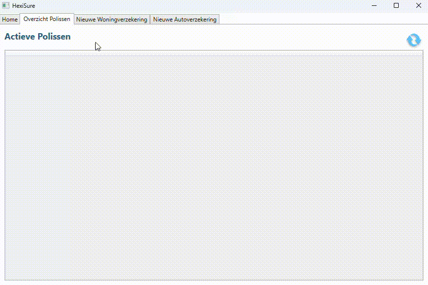
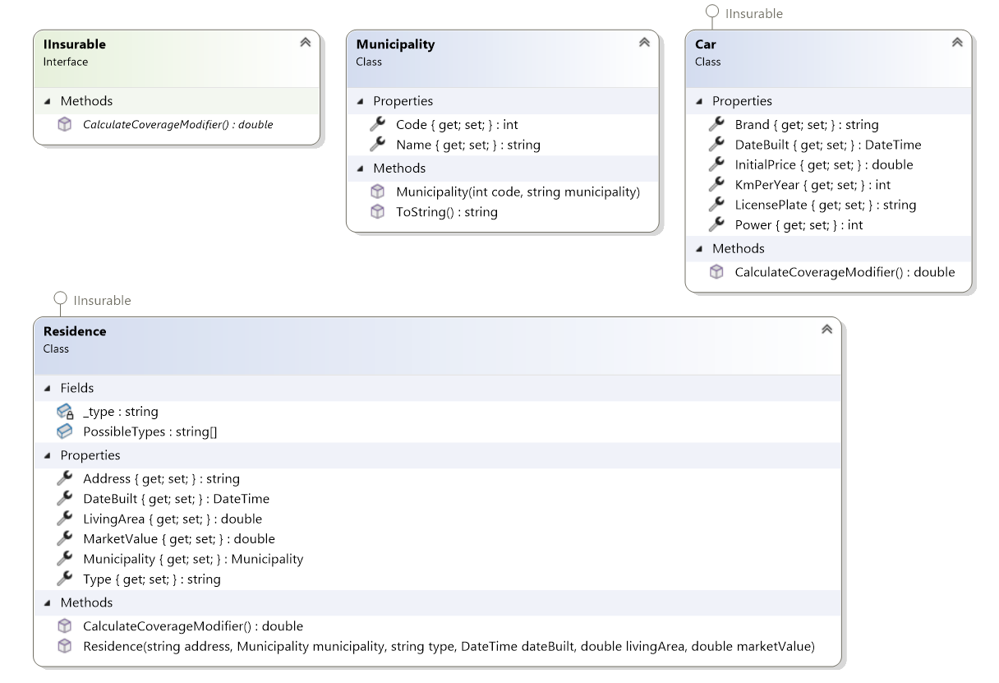
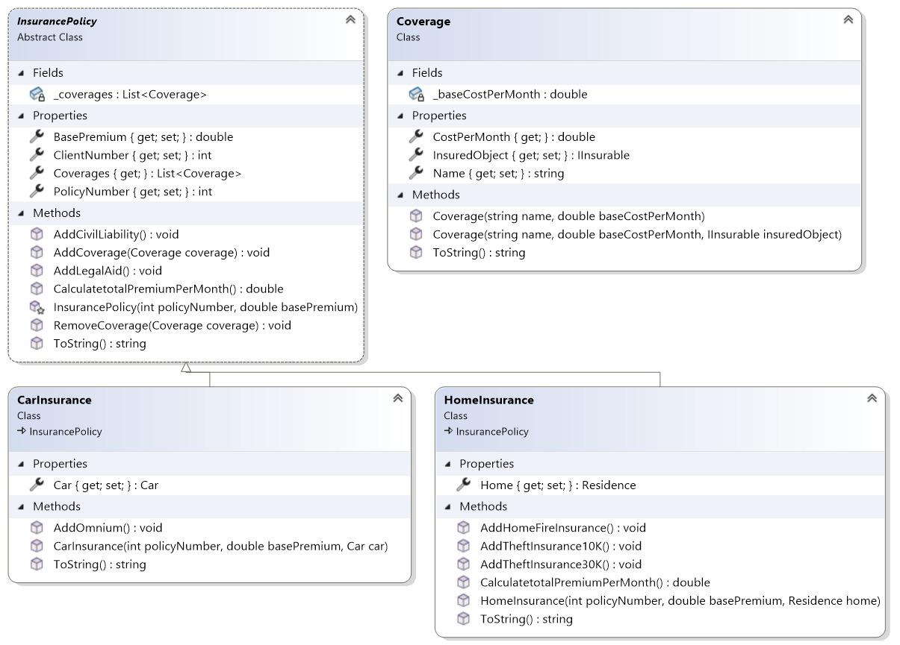
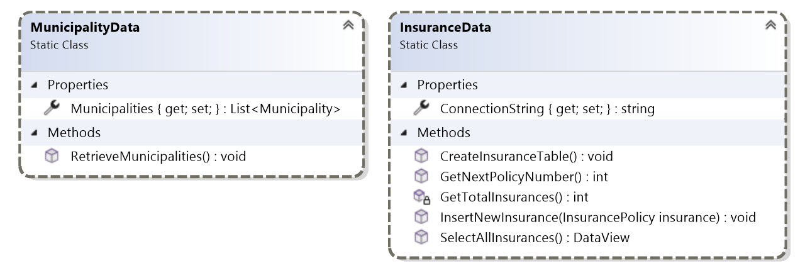
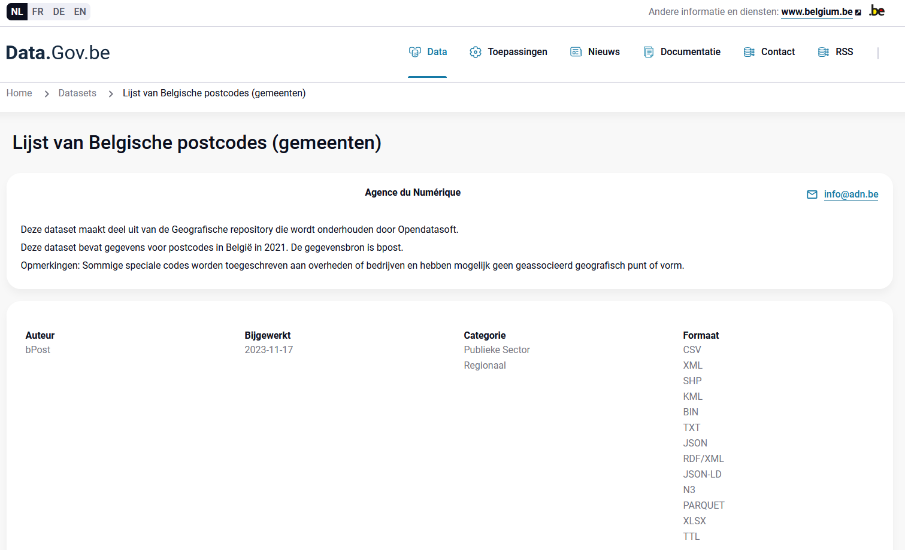

# Herhalingsoefening: HexiSure-Insurance


## 1. Inleiding
De studentenvereniging Hexion is van plan om een centje bij te verdienen door een verzekeringsmaatschappij op te richten, HexiSure. Jij bent deel van het team die de software schrijft voor de regionale kantoren die terugrapporteren naar het hoofdkantoor in de PXL. Zo kunnen leden van Hexion in de zomervakantie in hun eigen thuis-stad/dorp nieuwe polissen afsluiten en doorsturen naar het PXL-hoofdkantoor.

HexiSure start met het voorzien van twee soorten polissen: woonverzekeringen en autoverzekeringen. Een polis kan meerdere soorten dekkingen hebben.

Naar de toekomst toe zou HexiSure ook Familiale verzekeringen, Hospitalisatieverzekerignen, Vakantieverzekeringen enz. willen afsluiten. Met andere woorden focus op de schaalbaarheid van je code en vermijd redundante code.

> [!TIP]
> Bekijk eerst even de bestaande code zodat je al een eerste idee krijgt van wat er reeds geprogrammeerd is!



## 2. Database
Gebruik het volgende script om een nieuwe DataBase aan te maken voor HexiSure:
```
CREATE TABLE Insurances (
    PolicyNumber INT PRIMARY KEY,
    CostPerMonth DECIMAL(10, 2) NOT NULL,
    BasePremium DECIMAL(10, 2) NOT NULL,
    ClientNumber INT NOT NULL,
    Description VARCHAR(20)
);
```

Het hoofdkantoor in de PXL wil een overzicht bewaren van hoeveel inkomsten er getrokken worden door elk regionaal kantoor.

## 3. Class Library

Gebruik de class diagram om af te leiden welke datatypes er gebruikt worden voor de eigenschappen en methodes.

### 3.1 Entities – Insurables

Implementeer in de namespace `HexiSureClassLibrary.Entities.Insurables` de volgende klassen en interface op basis van de onderstaande functionele en technische vereisten. Zorg ervoor dat je bij elke klasse de juiste properties, constructoren en methoden voorziet volgens de specificaties.



#### Interface: IInsurable

- Definieer een interface `IInsurable`.
- Deze interface moet één methode bevatten: `CalculateCoverageModifier()`, die een `double` retourneert.
- Deze methode zal worden gebruikt om de premie-aanpassingsfactor te berekenen voor verzekerbare objecten.

---

#### Car

- Maak een klasse `Car` die `IInsurable` implementeert.
- Eigenschappen:
  - Brand
  - LicensePlate
  - DateBuilt
  - KmPerYear (Aantal kilometer per jaar)
  - Power (Vermogen in pk)
  - InitialPrice
- De klasse moet in staat zijn om via `CalculateCoverageModifier()` een factor te berekenen op basis van leeftijd, kilometers, vermogen en prijs van de wagen.
  - Gebruik de volgende formule: `modifier = InitialPrice / 10000.0 * (KmPerYear / 10000.0) * (Power / 120.0) * (1 - age/50)` waar `age` gelijk is aan de leeftijd van de wagen in jaren.

---

#### Municipality

- Maak een klasse `Municipality`.
- Eigenschappen:
  - Code (De postcode van de gemeente)
  - Name
- Voeg een constructor toe om deze twee waarden meteen in te stellen.
- Override `ToString()` zodat de gemeente getoond wordt als: `"Naam: Code"`.

---

#### Residence

- Maak een klasse `Residence` die `IInsurable` implementeert.
- Eigenschappen:
  - Address (Deze eigenschap bevat de straatnaam, huisnummer en busnummer)
  - Municipality
  - Type woning: enkel volgende types zijn toegelaten: `"Open"`, `"Half open"`, `"Gesloten"`, `"Appartement"`
	- Zorg er voor dat de setter van Type enkel de bovenstaande waardes toelaat.
  - DateBuilt
  - LivingArea (Bewoonbare oppervlakte in m²)
  - MarketValue
- Voorzie een constructor waarmee je alle bovenstaande gegevens kan instellen.
- Valideer bij instellen van het type of deze voorkomt in de opgelegde lijst.
- Implementeer `CalculateCoverageModifier()` op basis van leeftijd, oppervlakte en marktwaarde van de woning.
	- Gebruik de volgende implementatie:
	```
	int age = (int)(DateTime.Now - DateBuilt).TotalDays / 365;
	double ageFactor = 1 + Math.Min(age / 50.0, 0.5);
	double sizeFactor = Math.Max(Math.Min(LivingArea / 100.0, 2.0), 0.7);
	double valueFactor = Math.Min(Math.Max(MarketValue / 250000, 0.7), 3.0);
	return ageFactor * sizeFactor * valueFactor;
	```

---
### 3.2 Entities – Insurances

Implementeer in de namespace `HexiSureClassLibrary.Entities.Insurances` de volgende klassen en base class. Deze modellen vormen de kern van het verzekeringssysteem en moeten compatibel zijn met de `IInsurable`-implementaties uit het vorige onderdeel.



#### Abstracte klasse: InsurancePolicy

- Abstracte klasse die de basis vormt voor verschillende soorten verzekeringen.
- private variabele `_coverages` van het type `List<Coverage>`.
- Eigenschappen:
  - PolicyNumber (uniek identificerend)
  - BasePremium (per maand)
  - ClientNumber (Momenteel kan je nog geen ClientNumber ingeven in de WPF-applicatie. Insurances zijn dus standaard gekoppeled aan ClientNubmer 0.)
  - Coverages: readonly
- Methoden:
  - `AddCoverage(Coverage coverage)`:
    - Voegt een dekking toe als deze nog niet aanwezig is (op basis van naam). Indien je een dekking toevoegd die al in de lijst van `_coverages` zit, dan doet de setter niets.
  - `RemoveCoverage(Coverage coverage)`:
    - Verwijdert een bestaande dekking uit de lijst.
  - `AddCivilLiability()`:
    - Voeg een standaarddekking toe met vaste naam `"Burgelijke aansprakelijkheid"` en een maandelijkse prijs van €10 per maand.
  - `AddLegalAid()`:
    - Voeg een standaarddekking toe met vaste naam `"Rechtsbijstand"` en prijs van €20 per maand.
  - `CalculateTotalPremiumPerMonth()`:
    - Voorzie een methode die de totaalprijs per maand berekent: basispremie + alle dekkingprijzen van de polis.
  - Override `ToString()` zodat de dekkingennamen netjes geconcateneerd worden.

---

#### CarInsurance

- CarInsurance erft over van `InsurancePolicy`.
- Eigenschap:
  - Verwijzing naar het verzekerde `Car`-object.
- Constructor moet vereisen: polisnummer, basispremie en auto.
- Extra methode:
  - `AddOmnium()`: voegt een dekking, genaamd "Omnium", toe met een vaste basisprijs van €95 per maand en de verzekerde auto.
- `ToString()` om de soort verzekering aan te geven ("Car Insurance") gevolgd door de dekkingen, zoals in InsurancePolicy.
  - Bv: "Car Insurance: Omnium Rechtsbijstand Burgelijke aansprakelijkheid"

---

#### HomeInsurance

- HomeInsurance erft over van `InsurancePolicy`.
- Eigenschap:
  - Verwijzing naar het verzekerde `Residence`-object.
- Constructor moet vereisen: polisnummer, basispremie en woning.
- Extra methoden:
  - `AddHomeFireInsurance()` – voegt een dekking "Brandverzekering" toe met vaste basisprijs van €100 en het verzekerde `Residence`-object.
  - `AddTheftInsurance10K()` – voegt een dekking "Diefstalverzekering" toe met vaste prijs van €40 per maand, zonder `Residence`-object.
  - `AddTheftInsurance30K()` – voegt een dekking "Diefstalverzekering" toe met vaste prijs van €80 per maand, zonder `Residence`-object.
- `CalculateTotalPremiumPerMonth()`:
  - Vermenigvuldig de basispremie met de CostModifier van het `Residence`-object en tel er de maandelijkse kost bij op van elke dekking.
- `ToString()` om de soort verzekering aan te geven ("Home Insurance") gevolgd door de dekkingen, zoals in InsurancePolicy.
  - Bv: "Home Insurance: Brandverzekering Rechtsbijstand Diefstalverzekering"

---

#### Coverage

- Klasse die een type dekking representeert.
- private variabele: _baseCostPerMonth
- Eigenschappen:
  - Name
  - CostPerMonth: readonly die _baseCostPerMonth vermenigvuldigt met de CoverageModifier van het Insurable-object.
  - `IInsurable`-object: dit object kan null zijn.
- Constructoren:
  - Eén met naam en basisprijs.
  - Eén met naam, basisprijs én verzekerd object.
    - Hergebruik code indien mogelijk.
- `ToString()` geeft enkel de naam terug.

---

### 3.3 DataAccess

Implementeer in de namespace `HexiSureClassLibrary.DataAccess` de volgende klassen voor data-opslag en -opvraging. Dit gedeelte behandelt zowel database-interactie (SQL Server) als het inlezen van externe gegevens (CSV).



---

#### InsuranceData (static class)

Beheer van verzekeringspolissen in een SQL Server-database.

##### Algemeen
- Deze klasse gebruikt een `SqlConnection` met een statische `ConnectionString`.
- Doel: CRUD-achtige operaties (voornamelijk **Create** en **Read**) op de tabel `Insurances`.

##### Vereisten
- **ConnectionString**:
  - Moet publiek instelbaar zijn via een statische property.
  - Stel de ConnectionString in op basis van een string die je bewaart in de Settings file bij het opstarten van MainWindow.

- **InsertNewInsurance(InsurancePolicy insurance)**
  - Voegt een nieuwe polis toe aan de `Insurances`-tabel. Deze tabel bevat niet alle informatie van elke polis. In het PXL-hoofdkantoor zijn ze enkel geïnteresseerd in de samenvatting van de polis.
  - Sla volgende gegevens op:
    - `PolicyNumber` (Gebruikt GetNextPolicyNumber() om een nieuw polis nummer te genereren)
    - `CostPerMonth` (berekend via `CalculateTotalPremiumPerMonth`)
    - `BasePremium`
    - `ClientNumber`
    - `Description` (resultaat van `ToString()` van de verzekering)
  - **Let op!** Zorg er voor dat je correct SqlParameters gebruikt.

- **SelectAllInsurances()**
  - Geeft een `DataView` terug op basis van een `SELECT * FROM Insurances`.
  - Gebruik een SqlDataAdapter om de data op te halen.
  - Te gebruiken in bijvoorbeeld een `DataGrid` in de WPF-applicatie.

- **GetTotalInsurances()**
  - Hulpmethode: geef het totaal aantal verzekeringen terug in de database.

- **GetNextPolicyNumber()**
  - Genereert een uniek polisnummer gebaseerd op:
    - Jaar, maand, dag + aantal reeds bestaande polissen. (Gebruik GetTotalInsurances() om het aantal polissen op te vragen.)
  - Formule:
    ```
    PolicyNumber = {YYYY}{MM}{DD}{aantal records in 4 digits}
    ```
    - Bv: Het allereerste polis nummer ooit op 06/06/2025: 202506060000

---

#### MunicipalityData (static class)

Beheer van de lijst met Belgische gemeenten via een externe dataset. De Belgische overheid voorziet een dataset met informatie over alle gemeentes *https://data.gov.be/nl/datasets/httpswwwodwbbeexploredatasetpostal-codes-belgium*. Gebruik deze gegevens om alle municipalities aan te maken.



##### Vereisten
- **Municipalities**
  - Een publieke, statische lijst van `Municipality`-objecten. Deze lijst vul je met de gegevens uit het csv-bestand van data.gov.be, wat je kan terugvinden in het startproject.

- **RetrieveMunicipalities()**
  - Lees gegevens in vanuit het CSV-bestand: `files/postal-codes-belgium.csv`.
  - Sla de gegevens op als `Municipality`-objecten (code + naam).
  - De naam van elke gemeente kan in meerdere talen verschijnen in het bestand:
    - Gebruik het eerst beschikbare veld in volgorde van prioriteit: Nederlands > Frans > Duits.
  - Sla de volledige lijst op in de `Municipalities`-property.

---

### 4. WPF – MainWindow

Implementeer de WPF-gebruikersinterface van het verzekeringssysteem in een `MainWindow`. Deze interface moet toelaten om verzekeringen aan te maken, te filteren op gemeente, en het overzicht van bestaande polissen te bekijken die het PXL-hoofdkantoor bewaard.

---

#### 4.1 Initieel gedrag bij het opstarten

- Bij het laden van de `MainWindow`:
  - Stel de `ConnectionString` in voor `InsuranceData` met behulp van het Settings bestand.
  - Lees de lijst van Belgische gemeenten in via `MunicipalityData.RetrieveMunicipalities()`.
  - Zet de `MunicipalityComboBox.ItemsSource` op de lijst van gemeenten uit `MunicipalityData`.
    - Sorteer de lijst op basis van alfabetische volgorde op naam: A -> Z en vervolgens op basis van numerieke volgorde op postcode: 0 -> 9.

---

#### 4.2 RefreshButton
- Wanneer aangeklikt:
  - Toon alle verzekeringspolissen in de `PoliciesDataGrid` met behulp van `InsuranceData.SelectAllInsurances()`.

#### 4.3 ClearButton
- Wanneer aangeklikt:
  - Roep de hulpfunctie `ClearForm()` op om alle formuliergegevens te wissen.

---

#### 4.4 Create Insurance (Woningpolis)

##### CreateHomePolicyButton

- Wanneer aangeklikt:
  - Valideer of volgende velden correct ingevuld zijn:
    - `BasePremiumTextBox`, `MarketValueTextBox`, `LivingAreaTextBox` (moeten numeriek zijn)
    - `BuildDatePicker.SelectedDate` (mag niet leeg zijn)
    - `MunicipalityComboBox` en `TypeComboBox` (mogen niet leeg zijn)

- Indien geldig:
  - Maak een `Residence`-object aan op basis van adres, gemeente, type, bouwdatum, woonoppervlakte en marktwaarde.
  - Maak een `HomeInsurance`-object aan met een gegenereerd polisnummer en basispremie.
  - Voeg optionele modules toe indien de bijhorende checkboxes aangevinkt zijn:
    - Brandverzekering (`AddFireCheckBox`)
    - Diefstalverzekering tot 10.000 of 30.000 EUR (slechts één tegelijk)
    - Rechtsbijstand

  - Sla de nieuwe polis op via `InsuranceData.InsertNewInsurance()`.
  - Toon een bevestiging via een toastbericht. Gebruik hiervoor de methode `ShowToast(string message)`.
  - Wis het formulier na toevoeging. Gebruik hiervoor de methode `ClearForm()`.

- Indien ongeldig:
  - Toon een foutmelding via een toastbericht.

---

#### 4.5 Gemeentezoekfunctie

Er zijn heel veel gemeentes in België. Om de ComboBox aangenamer te maken voor gebruik, maak je zelf een filter. Gebruik geen bestaande functionaliteit, maar maak gebruik van LINQ om de gemeentes te filteren.

##### MunicipalityFilterTextBox – TextChanged Event
- Wanneer de tekst verandert:
  - Filter de gemeentelijst op basis van de ingevoerde substring (case-insensitive).
  - Werk de `MunicipalityComboBox.ItemsSource` bij met de gefilterde lijst.
    - Sorteer de lijst opnieuw gelijkaardig aan in 4.1.

---

 
### **Succes!**